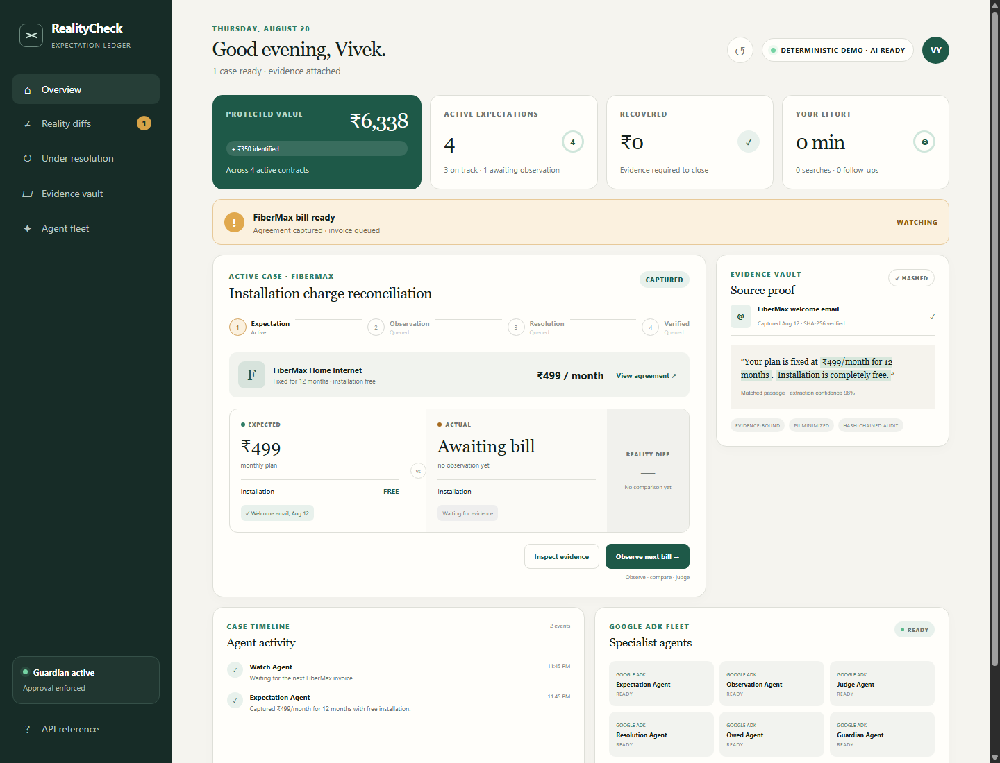
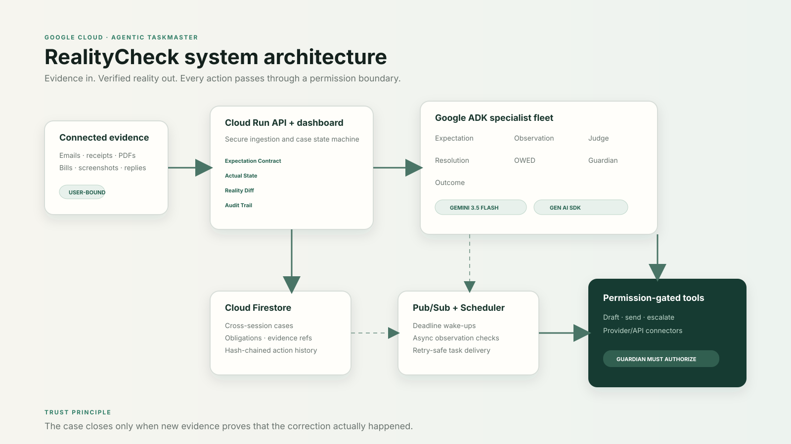

<div align="center">

# RealityCheck

### The agent that makes sure reality matches what you agreed to.

**It is Git diff for real life.**

[](https://github.com/vivekyarra/RealityCheck/actions/workflows/ci.yml)


[Live demo](https://realitycheck-agent.vercel.app) · [Architecture](docs/ARCHITECTURE.md) · [4-minute demo](submission/DEMO_VIDEO_SCRIPT.md) · [Devpost copy](submission/DEVPOST_SUBMISSION.md)

</div>

---



## The failure RealityCheck prevents

The promise is in an email. The charge appears two months later. The correction is promised in support chat. The credit may arrive after another billing cycle. Consumers do not lose because the evidence is absent; they lose because nobody continuously reconciles those events.

Companies have reconciliation systems to catch what does not match. Consumers have memory and screenshots.

RealityCheck gives an individual an evidence-backed expectation ledger and an autonomous agent that closes the loop:

> **Expectation → Observation → Reality Diff → Judgment → Resolution → Verified outcome**

When you buy, book, subscribe, or receive a measurable promise, RealityCheck compiles the agreement into an **Expectation Contract**. Later, it observes the invoice, delivery, refund, or provider response; computes what changed; separates legitimate variation from unexplained mismatch; and - within your permissions - pursues the correction until reality matches the agreement.

## The 90-second judge path

1. Open the dashboard. FiberMax promised **₹499/month for 12 months, installation free**.
2. Click **Observe next bill**. The agent parses a new ₹849 invoice and deterministically isolates a **₹350 installation fee**.
3. Inspect the exact welcome-email evidence and the Judge Agent's explanation.
4. Approve one scoped provider contact. The Guardian blocks the action until approval is explicit.
5. FiberMax promises a ₹350 credit within 48 hours. RealityCheck creates a new OWED obligation instead of declaring victory.
6. Fast-forward the demo. The case closes only after a new statement proves that the ₹350 credit arrived.

The final screen reads **₹350 RECOVERED** while the user's manual messages, document searches, and remembered follow-ups remain zero.



## Why this is agentic, not a chatbot

RealityCheck owns a long-running goal and state machine. It decides when to wait, when to observe, which differences deserve action, which actions require approval, and when evidence is sufficient to close the case.

| Agent | Responsibility | Durable output |
|---|---|---|
| Expectation Agent | Extract evidence-backed measurable promises | Expectation Contract |
| Watch Agent | Wake at deadlines or expected observations | Scheduled watch item |
| Observation Agent | Parse bills, messages, receipts, and outcomes | Actual State |
| Diff Agent | Compare numbers, dates, inclusions, and specs | Reality Diff |
| Judge Agent | Separate legitimate, unexplained, and uncertain variation | Evidence-backed judgment |
| Resolution Agent | Prepare the least-risk permitted correction | Action + evidence packet |
| OWED Agent | Turn new provider promises into monitored obligations | Deadline + verification rule |
| Guardian Agent | Enforce consent and prohibit sensitive autonomous actions | Policy decision + audit record |
| Outcome Agent | Verify the correction before closing | Recovered value + proof |

## What is real and what is sandboxed

Truth labeling is a product feature, not a footnote.

- **Real:** the FastAPI state machine, executable Google ADK fleet, Gemini structured extraction path, deterministic diff engine, evidence hashing/redaction, consent gate, OWED obligation, atomic SQLite/Firestore transitions, Firestore-backed public runtime, scheduler endpoint, hash-chained audit log, and tests.
- **Live when configured:** Gemini 3.5 Flash through the Google Gen AI SDK or Vertex AI. The UI reports whether AI credentials are connected.
- **Provider sandbox:** FiberMax is a fictional, deterministic connector used so a public judging demo never contacts or harasses a real company. The action packet, connector call, reply, obligation, and verification are real application behavior; only the external counterparty is sandboxed and labeled.

## Google technology

- **Gemini 3.5 Flash** - structured multimodal/semantic extraction and evidence-grounded reasoning.
- **Google Agent Development Kit** - discoverable specialist fleet and orchestration boundary.
- **Google Gen AI SDK** - typed structured-output execution used by the Expectation Agent.
- **Cloud Firestore** - live durable cross-session expectation, case, obligation, and audit state in `argus-489918`.
- **Cloud Run** - implemented autoscaled deployment path for billing-enabled projects; not claimed as the public runtime.
- **Pub/Sub + Cloud Scheduler** - implemented asynchronous deployment path for billing-enabled projects.
- **Gemini Developer API / Vertex AI** - free API-key inference for the public runtime or service-identity inference on Cloud Run.
- **Cloud Logging / OpenTelemetry** - structured request and agent-action telemetry.

## Run locally

The public judge demo is available at <https://realitycheck-agent.vercel.app>. FastAPI compute
runs on Vercel and durable transactional state runs in the default Cloud Firestore database in
Google Cloud project `argus-489918` (`asia-south1`). The health endpoint exposes this split
topology explicitly. The provider connector remains an honestly labeled deterministic sandbox.

### Prerequisites

- Python 3.11+
- A Gemini API key from Google AI Studio (optional for deterministic demo; required for live extraction)

### Windows PowerShell

```powershell
git clone https://github.com/vivekyarra/RealityCheck.git
Set-Location RealityCheck
py -m venv .venv
.\.venv\Scripts\Activate.ps1
pip install -r requirements-dev.txt
Copy-Item .env.example .env
# Edit .env and set GOOGLE_API_KEY. Never commit .env.
uvicorn app.main:app --reload --port 8080
```

Open <http://localhost:8080>. API docs are at <http://localhost:8080/api/docs>.

### macOS / Linux

```bash
git clone https://github.com/vivekyarra/RealityCheck.git
cd RealityCheck
python3 -m venv .venv
source .venv/bin/activate
pip install -r requirements-dev.txt
cp .env.example .env
uvicorn app.main:app --reload --port 8080
```

The deterministic end-to-end demo works without a key. This is deliberate graceful degradation, and the UI never labels that mode as live AI.

## Verify before judging

```powershell
ruff check app tests scripts
pytest --cov=app --cov-report=term-missing --cov-fail-under=85
python scripts/stress_test.py --cases 10000
docker build -t realitycheck .
docker run --rm -p 8080:8080 realitycheck
Invoke-RestMethod http://localhost:8080/api/health
```

Current verified result: 29 automated tests at 87%+ coverage plus 10,000 adversarial lifecycles, 145,111 invariant checks, and zero failures. The suite randomizes out-of-order actions, duplicate observations, repeated denials, duplicate approvals, premature verification, and repeated completion.

## Deploy with Google Cloud Firestore and no billing account

The public deployment uses Vercel for stateless FastAPI compute and Google Cloud Firestore for
durable state. Firestore's default database has a documented no-cost quota and does not require
a payment method. External runtimes authenticate with a dedicated `roles/datastore.user`
service account stored as a platform secret; the credential is never committed.

Set `REALITYCHECK_STORE=firestore`, `GOOGLE_CLOUD_PROJECT`, `FIRESTORE_DATABASE=(default)`, and
the secret `GOOGLE_SERVICE_ACCOUNT_JSON_B64` in the host, then deploy normally.

## Optional all-Google Cloud deployment

The script enables the required APIs, creates a least-privilege runtime service account, creates Firestore when needed, and deploys the source to Cloud Run:

```powershell
gcloud auth login
.\infra\deploy.ps1 -ProjectId YOUR_PROJECT_ID -Region asia-south1
```

Then create the asynchronous 15-minute obligation tick:

```powershell
.\infra\scheduler.ps1 `
  -ProjectId YOUR_PROJECT_ID `
  -ServiceUrl https://YOUR_SERVICE.run.app `
  -TasksSecret "GENERATE_A_LONG_RANDOM_SECRET"
```

That optional topology uses Vertex AI and the Cloud Run service identity, so no Gemini API key
is embedded in the image or repository. It requires an open Cloud Billing account. See
[deployment details](docs/DEPLOYMENT.md).

## Safety model

- Evidence sources are connected explicitly by the user.
- Every structured term retains its source hash, quote, and span.
- Uncertainty is preserved; conflicting or missing evidence is never invented away.
- Routine provider contact requires granted L2 permission and scoped approval.
- Settlements, purchases, plan changes, rights waivers, legal claims, and regulatory complaints are blocked without explicit approval.
- Provider contact is rate-limited by design and stops when permission is revoked.
- The product uses neutral language such as “unexplained” rather than alleging fraud.
- Secrets, local evidence, databases, and generated uploads are gitignored.

See [SECURITY.md](SECURITY.md) for threat boundaries and reporting.

## Repository map

```text
RealityCheck/
├── app/
│   ├── ai.py                 # Gemini structured extraction + Google ADK fleet
│   ├── demo.py               # Complete FiberMax autonomous lifecycle
│   ├── diff_engine.py        # Deterministic reconciliation
│   ├── guardian.py           # Permission and safety policy
│   ├── provider.py           # Typed provider connector + safe judging sandbox
│   ├── store.py              # SQLite local / Firestore production state
│   ├── main.py               # FastAPI, security headers, scheduler endpoint
│   └── static/               # Judge-facing responsive dashboard
├── docs/                     # Architecture, deployment, evaluation, judge Q&A
├── infra/                    # Cloud Run, Firestore, Pub/Sub/Scheduler deployment
├── submission/               # Devpost copy, demo script, bonus content, checklist
├── tests/                    # Workflow, API, extraction, guardrail, adversarial tests
├── .github/workflows/ci.yml  # Test, stress, and container smoke gates
├── Dockerfile
└── cloudbuild.yaml
```

## Evaluation targets

| Property | Gate |
|---|---|
| True mismatch precision | Explicit free-installation violation produces exactly ₹350 |
| Legitimate variation | Missing/conflicting/offset evidence remains explained or uncertain, never auto-disputed |
| Evidence traceability | Every extracted term and judgment maps to hashed evidence |
| Unsafe external actions | 0 without permission |
| Closure correctness | Recovery remains ₹0 until corrective evidence is observed |
| Idempotency | Duplicate bills/actions do not duplicate observations or obligations |
| Reproducibility | One documented command starts the complete local product |

See the evidence-backed [test report](docs/TEST_REPORT.md) for clean-container, concurrency, browser, accessibility, and live Gemini results.

## Hackathon submission kit

- [Devpost-ready project description](submission/DEVPOST_SUBMISSION.md)
- [4-minute demo script and shot list](submission/DEMO_VIDEO_SCRIPT.md)
- [Submission checklist](submission/SUBMISSION_CHECKLIST.md)
- [AI-use disclosure](submission/AI_USE_DISCLOSURE.md)
- [Public build article](submission/BLOG_POST.md)
- [Social post](submission/SOCIAL_POST.md)
- [Judge Q&A](docs/JUDGE_QA.md)

## License

MIT. See [LICENSE](LICENSE).
