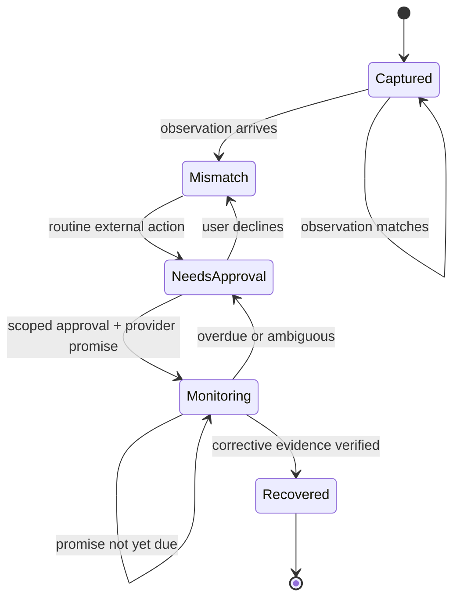

# Architecture

RealityCheck separates semantic understanding from deterministic truth checks and separates both from permissioned action.

## State flow

## Boundary decisions

1. Gemini extracts semantic facts and evidence spans; the numeric/date/spec diff is deterministic wherever possible.
2. A mismatch is not automatically wrongdoing. The Judge receives line-item explanations and preserves uncertainty.
3. The Resolution Agent cannot bypass Guardian policy. L3/L4 actions always need stronger authorization.
4. A provider response is not an outcome. The OWED Agent converts it into a new obligation and the Outcome Agent requires later proof.
5. Local development uses SQLite for zero-friction reproducibility. Production switches to Firestore using the same typed case model and transactional mutations.
6. Every audit event commits to the previous event hash. Rewriting an earlier event invalidates the chain.

## Deployment topology

- One stateless Cloud Run service hosts the dashboard and API.
- Firestore stores case documents and audit history.
- Cloud Scheduler calls the authenticated task endpoint every 15 minutes; Pub/Sub is available for connector fan-out.
- Vertex AI is accessed with the Cloud Run service identity. No model credential is baked into the image.
- Structured logs contain case/action identifiers but exclude full evidence text.

## Honest external boundary

The public demo calls a typed provider connector backed by the fictional FiberMax sandbox. It exercises the real action packet, reply parsing, obligation creation, deadline, and outcome verification without claiming that a real company was contacted. Replacing that connector with an approved provider API does not change the case state machine or Guardian policy.
